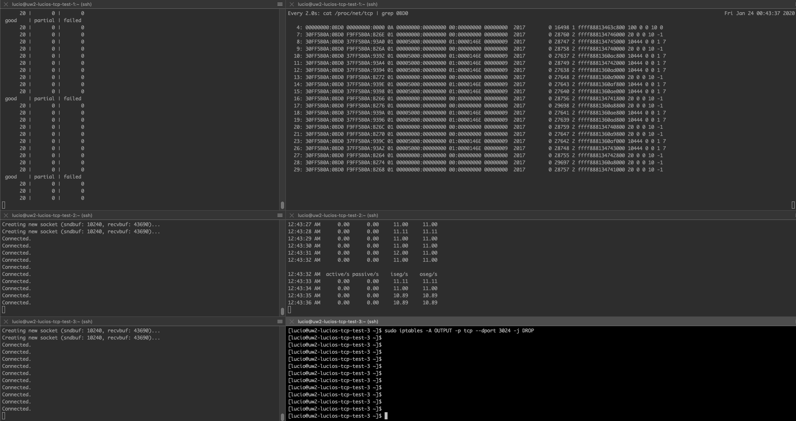

# Java TCP load and performance test

This is an experiment to test some performance aspects of a Java NIO TCP server.

It is basically made of two parts: TcpServer and TcpClientBatch. The former runs a vanilla NIO non-blocking server and the latter spawns a certain number of NIO, also non-blocking, TCP clients which will connect to the server part.

Upon connection, the client doesn't send anything. It just sits waiting for data from the server. The server, on its turn, will start sending random bytes of data to each connected client.

## How to build and run

Make sure you have at least Java 1.8. To install it:

    sudo yum install java-1.8.0-openjdk

Then use this to change the system's current Java to the newly installed:

    sudo update-alternatives --config java

On the machine you'll build the project, make sure you have Gradle installed. To build it:

    gradle jar
    
Then run both `server.sh` and `client.sh`, each on a separate terminal window. They will look for `tcp-java-perf-1.0-SNAPSHOT.jar`, which should be either in the same folder or in `build/libs`.

To run the server:

    ./server.sh 3000

Where `3000` should be replaced by the port the server should listen on.

And the client:

    ./client.sh 1.2.3.4 3000 100

Where `1.2.3.4` is the server's IP address, `3000` is the server port and `100` is how many socket connections should be opened.

## Things learned

### Do not create sockets in a separate thread

For some reason when developing this test, I thought it would be wise to create my client connections in a separate thread, register the associated socket channels for OP_CONNECT and then handle them in the main thread, after they were allegedly ready for `finishConnect()`.

This did not work as the socket channel object is not thread safe, thus not guaranteed to be synchronized. I was frequently getting a `NoConnectionPendingException` calling `finishConnect()` when running tests because apparently the main thread saw SelectionKey firing the `OP_CONNECT` event, but the SocketChannel was not fresh in main thread's local memory, so `finishConnect()` was failing because it thought `connect()` was not called yet (some internal variable was probably old in main thread's point of view).

Moreover, establishing a new connection in a separate thread takes an absurd amount of time. The application freezes for seconds. Not sure what happens there, but anyway... fixed by moving everything to the main thread (it is non-blocking, after all).

## Parameters to adjust

- select() wait time: how does this influence the maximum throughput the server can achieve?
- right now the logic is periodically sending to all clients at once, but this is effectively the bandwidth that can be used. One better approach would be to uniformly spread clients at random in the sending window. Of course, the sending resolution would be higher for lower wait times (see point above);
- the sending period also obviously limits the maximum bandwidth the server can achieve

### Useful commands

To prevent TCP ACKs from getting to the server, run this on the client machine:

    sudo iptables -A OUTPUT -p tcp --dport 3023 -j DROP

To list existing firewall rules:

    sudo iptables -S

And to list with rule number:

    sudo iptables -L -v -n --line-numbers

To delete a rule (e.g., rule 1):

    sudo iptables -D OUTPUT 1

Run this to observe client sockets and their queues:

    watch -n 1 'cat /proc/net/tcp | grep 0BD0'

### Relevant read

https://en.wikipedia.org/wiki/Software_performance_testing
